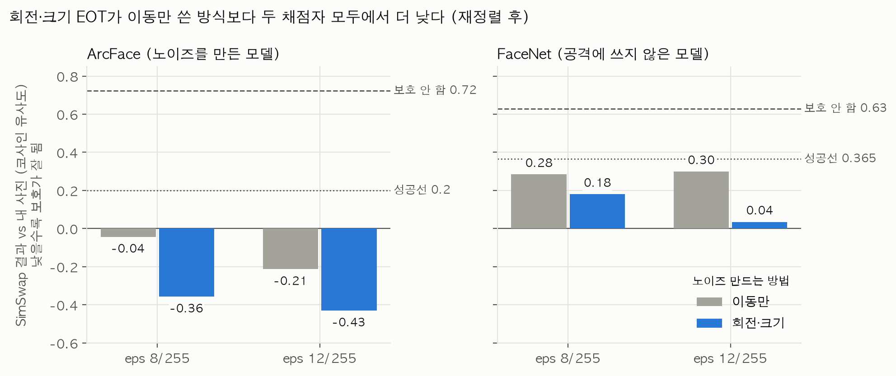
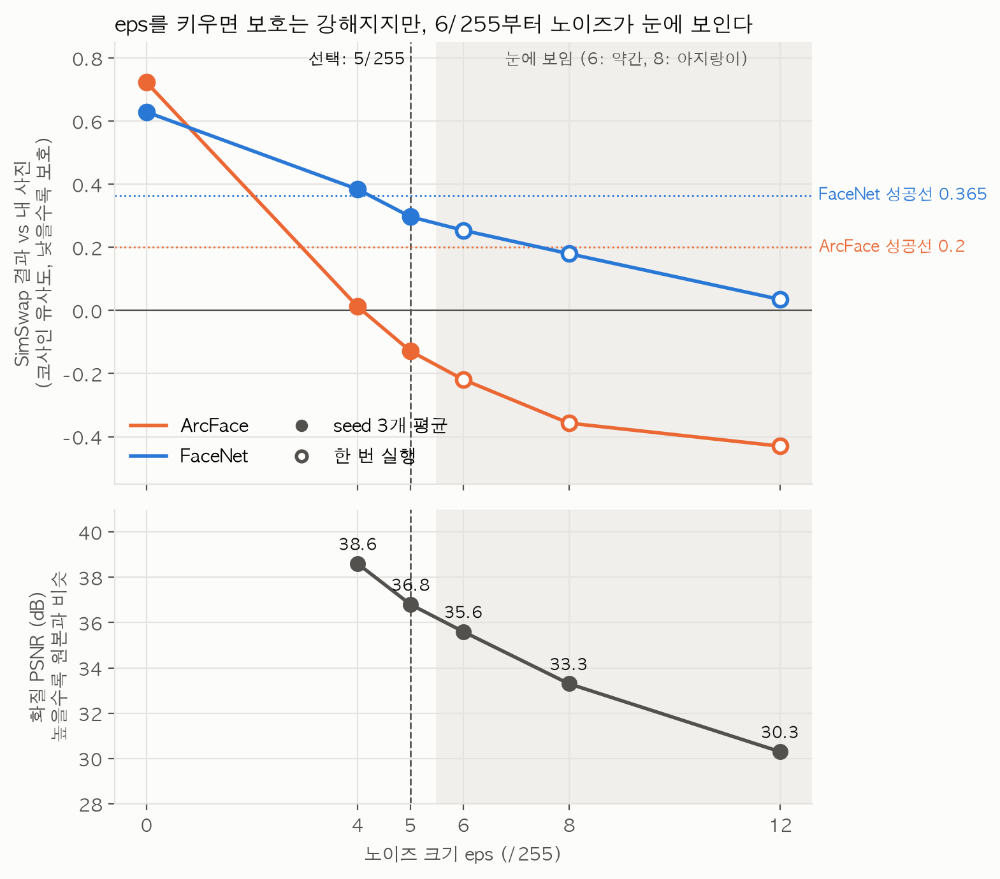
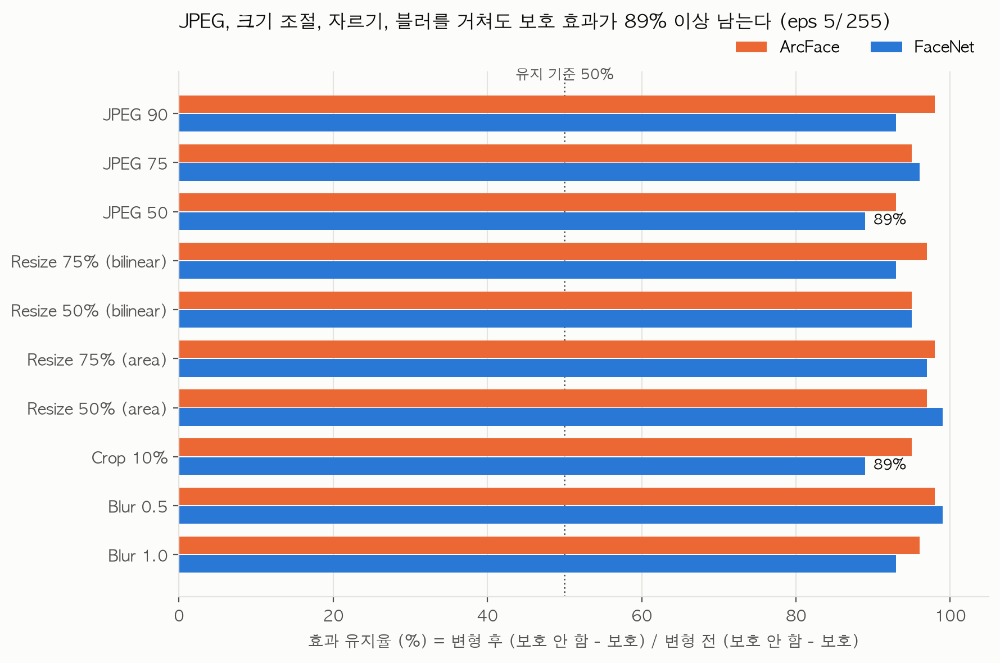

# Week 6 — Face swap 보호 효과 측정 및 Robustness 실험

> Week 6 완료. 결론: 눈에 거의 안 보이는 노이즈(eps 5/255, 회전·크기 EOT)로 SimSwap을 막고, JPEG·크기 조절·자르기·블러 후에도 효과의 89% 이상이 남는다.

## 요약

### 결론
| 항목 | 결과 |
|---|---|
| 노이즈 설정 | **eps 5/255, 회전·크기 EOT (변형 4개), steps 30** |
| 보호 효과 (SimSwap 결과 vs 내 사진, 재정렬 후, seed 3개 평균) | ArcFace 0.72 → **-0.13**, FaceNet 0.63 → **0.29** (판정선 0.2 / 0.365) |
| 변형 견고성 | JPEG 90/75/50, Resize, Crop, Blur 11가지 모두 효과 **89% 이상 유지** |
| 화질 | PSNR 약 36.8dB. 확대하면 보이지만 4/255와 비슷한 수준 |
| 한계 | 사진 4장 중 1장(a_4)은 FaceNet 기준 부분 보호. 실험은 얼굴만 잘라낸 224×224 사진으로 진행 |

### 이렇게 결정했다
1. 노이즈 만드는 방법 (②): 재정렬의 회전·크기 변화까지 견디도록 EOT를 넓혔더니, 이동만 쓴 방식보다 두 평가 모델 모두에서 확실히 낮아졌다 → 채택
2. 노이즈 크기 (③ ~ ④): 숫자로는 8/255가 충분했지만 눈으로 보니 아지랑이처럼 보였다. 4와 8 사이를 확인하고 seed 3개로 반복해서, 눈에 안 보이는 것 중 효과가 가장 좋은 5/255를 골랐다
3. 변형 견고성 (⑤): 보호 안 한 사진과 나란히 비교해서, 변형 후에도 노이즈가 살아남는 것을 확인했다

- 그래프 코드: `experiments/week6_plots.py`
- eps 6, 8, 12는 한 번 실행한 값(빈 원), eps 0, 4, 5는 seed 3개 평균(채운 원)이라 흔들림 폭이 다르다

---

## 목표
face swap(SimSwap)에 대한 보호 효과가 현실의 변형(재정렬, JPEG, 크기 조절 등)을 거쳐도 유지되는지 확인하고, 핵심 결과를 표와 그래프로 확보한다.

## 한 일
- [x] ① 실험 환경 정리: 반복 실험용 새 노트북 (`notebooks/simswap_robustness.ipynb`). 노이즈 없는 결과(eps=0)가 Week 5와 소수점까지 같아서, 같은 방식으로 합성·평가함을 확인
- [x] ② 재정렬 견고성: EOT에 회전·크기 변화 추가 → 채택
- [x] ③ eps, steps별 보호 효과와 화질 (PSNR, SSIM, 눈으로 비교) → 8/255는 눈에 보여서 탈락, steps 30
- [x] ③-2 4/255 근처에서 효과 높이기: eps 5, 6 확인, EOT 변형 8개 시도
- [x] ④ 반복 실행 (seed 3개로 평균, 편차) → eps 5/255, 변형 4개, steps 30
- [x] ⑤ 변형 견고성: JPEG, Resize, Crop, Blur → ArcFace 93% 이상, FaceNet 89% 이상 유지
- [x] ⑥ 여러 모델 함께 공격 → 건너뜀 (Week 8 후보)
- [x] ⑦ 정리: 요약, 그래프 3장

## 핵심 개념

### 1. 회전·크기 EOT
- SimSwap의 재정렬은 얼굴을 다시 찾아 눈·코·입 5개 점에 맞추면서 1픽셀 이동뿐 아니라 살짝 회전하고 크기를 바꾸기도 한다.
- 반복할 때마다 무작위 변형 4개(회전 ±3도, 크기 ±5%, 이동 ±2픽셀, 1개는 변형 없음)를 뽑아 각각의 유사도 평균을 낮추도록 노이즈를 만든다. 회전·크기는 값이 연속적이라 전부 계산할 수 없어서 무작위로 뽑는다.
- 미분 가능한 변환(`affine_grid`, `grid_sample`)을 써서 기울기가 원래 픽셀까지 전달된다. 같은 변형을 보호 얼굴과 원본 얼굴에 둘 다 적용해서, 노이즈 때문에 낮아진 것만 센다.

### 2. seed
- 무작위 요소는 랜덤 출발과 무작위 변형 두 곳이다. 그래서 같은 설정으로 돌려도 결과가 매번 조금씩 다르다. 노이즈가 없으면(eps=0) 무작위 요소가 없어 항상 같은 값이 나온다.
- seed를 고정하면 같은 무작위 값이 나와 결과가 재현된다(`random.seed`, `torch.manual_seed`). 결론은 여러 seed의 평균으로 낸다.
- `run()`에 seed를 넣은 것은 ④부터다. ②, ③, ③-2의 결과는 seed 없이 돌린 것이다.

### 3. steps
- PGD로 노이즈를 고치는 반복 횟수. 보폭은 `2.5 × eps / steps`라서 steps가 많을수록 더 작은 걸음으로 더 많이 고친다. 노이즈 최대 크기(eps)는 같으므로 화질은 바뀌지 않는다.

### 4. SSIM
- PSNR은 픽셀 값 차이만 본다. SSIM은 작은 영역(11×11)마다 밝기·대비·구조가 얼마나 비슷한지 보고 평균해서, 사람 눈이 느끼는 차이에 더 가깝다. 1에 가까울수록 원본과 비슷하다.

## ② 회전·크기 EOT

### 방법
- 새 함수 `pgd_identity_eot`: 반복마다 무작위 변형 4개의 평균 유사도를 낮춤. 랜덤 출발, 보폭, 크기 제한은 Week 5와 같음
- 같은 세션에서 Week 5 방식(이동만)과 새 방식(회전·크기·이동)을 나란히 실행해 비교했다. 같은 조건에서 방법만 다르게 해야 공정하다.
- 조건: steps 30, 한 번 실행. 평가는 (B) 재정렬

### 결과
(B) 재정렬, 결과 vs 내 사진 (ArcFace)
| eps | 방식 | a_1 | a_2 | a_3 | a_4 | 범위 |
|---|---|---|---|---|---|---|
| 8 | 이동만 | -0.037 | -0.086 | 0.032 | -0.079 | -0.09 ~ 0.03 |
| 8 | 회전·크기·이동 | -0.369 | -0.425 | -0.290 | -0.343 | **-0.43 ~ -0.29** |
| 12 | 이동만 | -0.159 | -0.291 | -0.188 | -0.213 | -0.29 ~ -0.16 |
| 12 | 회전·크기·이동 | -0.411 | -0.508 | -0.381 | -0.418 | **-0.51 ~ -0.38** |

(B) 재정렬, 결과 vs 합성에 쓴 내 사진 (FaceNet, `experiments/week6_facenet_eval.py`)
| | a_1 | a_2 | a_3 | a_4 | 판정 | PSNR |
|---|---|---|---|---|---|---|
| eps0 (보호 안 함) | 0.593 | 0.704 | 0.594 | 0.626 | 부분/실패 | - |
| 8, 이동만 | 0.283 | 0.209 | 0.258 | 0.385 | 3장 성공, 1장 부분 | 33.2dB |
| 8, 회전·크기 | 0.149 | 0.137 | 0.257 | 0.175 | 4장 모두 성공 | 33.3dB |
| 12, 이동만 | 0.288 | 0.267 | 0.306 | 0.334 | 4장 성공 | 30.3dB |
| 12, 회전·크기 | -0.029 | -0.033 | 0.072 | 0.130 | 4장 모두 성공 | 30.3dB |

- eps0은 Week 5의 재정렬 결과를 그대로 썼다. 노이즈가 없으면 무작위 요소가 없어 같은 값이 나온다.
- 전체 결과 (합성에 쓰지 않은 사진과의 비교 포함): `results/week6/facenet_step2.txt`

### 해석
- 4장 모두, eps 두 가지 모두, 두 평가 모델 모두에서 낮아졌다. ArcFace는 8/255에서 평균 약 0.3이 더 떨어졌다.
- 재정렬 손실이 거의 사라졌다. 새 방식의 (B) 재정렬 결과(-0.43 ~ -0.29)가 Week 5의 (A) 직접(-0.50 ~ -0.35) 수준까지 왔다. Week 5에서 재정렬 후 효과가 손실된 원인이 회전·크기 변화였다.
- 8/255로 FaceNet까지 4장 모두 성공했다. Week 5에서는 12/255가 필요했다.
- 같은 eps면 PSNR이 같다. 노이즈 크기는 그대로 두고 만드는 방법만 바꿔 효과를 높였다.

### 채택 판단: 채택
| 기준 | 결과 |
|---|---|
| 효과가 확실히 좋아졌나 | ArcFace, FaceNet 모두 4장 × eps 2가지(16개 비교)에서 낮아짐 |
| 우연이 아닌가 | 16개 비교가 전부 같은 방향이라 가능성은 낮음. ④에서 여러 seed로 최종 확인 |
| 대가가 크지 않나 | 화질 같음, 실행 시간 문제없음 |

## ③ eps, steps와 화질

### 방법
- 조합: eps 4, 8, 12 /255 × steps 30, 50 = 6가지
- 화질: PSNR, SSIM, 눈으로 비교
- 결정 기준 (실험 전에 정함): ArcFace와 FaceNet 모두 4장이 성공인 설정 중 eps가 가장 작은 것. 비슷하면 steps는 시간이 덜 드는 30

### 결과 ((B) 재정렬, 사진 4장)
| eps | steps | ArcFace | FaceNet (합성에 쓴 사진) | PSNR | SSIM |
|---|---|---|---|---|---|
| 0 | - | 실패 (0.68 ~ 0.77) | 0.59 ~ 0.70 | - | 1 |
| 4 | 30 | 4장 성공 (-0.19 ~ 0.15) | 2장 성공, 2장 부분 (0.27 ~ 0.58) | 38.6dB | 0.90 ~ 0.96 |
| 4 | 50 | 4장 성공 (-0.22 ~ 0.13) | 2장 성공, 2장 부분 (0.30 ~ 0.54) | 38.5dB | 0.91 ~ 0.96 |
| 8 | 30 | 4장 성공 (-0.43 ~ -0.29) | 4장 성공 (0.14 ~ 0.26) | 33.3dB | 0.80 ~ 0.89 |
| 8 | 50 | 4장 성공 (-0.41 ~ -0.25) | 4장 성공 (0.03 ~ 0.25) | 33.3dB | 0.80 ~ 0.89 |
| 12 | 30 | 4장 성공 (-0.51 ~ -0.38) | 4장 성공 (-0.03 ~ 0.13) | 30.3dB | 0.70 ~ 0.80 |
| 12 | 50 | 4장 성공 (-0.52 ~ -0.42) | 4장 성공 (-0.13 ~ 0.10) | 30.3dB | 0.71 ~ 0.80 |

사진별 전체 결과: `results/week6/facenet_step3.txt`

### 해석
- 4/255는 FaceNet에서 아직 부족하다. ArcFace는 4장 모두 성공이지만 FaceNet은 a_3, a_4가 부분이다.
- 8/255부터 두 평가 모델 모두 4장 성공이다. 미리 정한 기준에 맞는 가장 작은 eps다.
- steps 50은 30보다 확실히 낫지 않다. 사진마다 좋아지기도 나빠지기도 해서 무작위성에 의한 흔들림과 구분되지 않는다.
- 화질은 eps가 정한다. eps 4 → 8 → 12에서 PSNR은 38.6 → 33.3 → 30.3dB, SSIM 평균은 약 0.95 → 0.86 → 0.77로 떨어진다. a_4는 같은 eps에서 SSIM이 다른 사진보다 0.06 ~ 0.09 낮다.

### 눈으로 본 결과 (a_4, SSIM이 가장 낮아 노이즈가 가장 잘 보일 사진)
- 4/255: 거의 안 보인다.
- 8/255: 아지랑이처럼 노이즈가 보여서 SNS에 쓸 수 없다.

### 결정
- 숫자 기준으로는 8/255가 통과했지만, 눈으로 보니 아지랑이처럼 보여 탈락했다. 미리 정한 판단 기준에 화질 조건이 빠져 있었다.
- 그래서 눈에 거의 안 보이는 4/255를 잠정 기본값으로 정하고, 효과를 높이는 방법을 찾았다 (→ ③-2, ④에서 최종 5/255).

## ③-2 4/255 근처에서 효과 높이기
- 문제: 4/255에서 ArcFace는 4장 모두 속지만 FaceNet은 2장만 속는다 (전이성 문제).
- 시도: (1) 크기 조정: eps 5, 6 확인. 6은 눈에 보여 탈락, 5는 4와 비슷 (2) 방법 개선: EOT 변형 4개 → 8개 (n8). 모멘텀, 여러 모델 함께 공격은 Week 8 후보로 남김
- 한 번씩 돌린 결과로는 고를 수 없었다. 같은 설정(eps 4, n4)을 다시 돌렸더니 a_4가 0.579 → 0.344로 0.24나 달라졌고, 이 흔들림이 설정끼리의 차이보다 컸다. 원인은 `run()`에 seed가 없었던 것과, FaceNet 점수가 판정선(0.365) 근처에 몰려 있던 것이다. → ④에서 seed 3개로 반복해 평균으로 비교
- 판정선은 올리지 않았다. 결과를 본 뒤 기준을 바꾸면 기준이 결과에 맞춰 움직인 것이 된다. 대신 보호 안 했을 때보다 얼마나 떨어졌는지를 판정과 함께 기록한다.
- 한 번씩 돌린 결과: `results/week6/facenet_step3_2.txt`

## ④ 반복 실행 (seed 3개)

### 방법
- `run()`에 seed를 추가하고, 후보 3개(eps 4 n4, eps 4 n8, eps 5 n4) × seed 0, 1, 2 = 9개 실험을 같은 세션에서 실행했다. eps 6 이상은 눈에 보여서 제외했다.
- FaceNet 평가 코드에 seed 묶음 요약을 추가했다. 이름 끝의 `_seedN`만 다른 결과를 묶어 사진별 평균 ± 표준편차를 계산하고, 판정은 평균으로 한다.

### 결과
ArcFace ((B) 재정렬, seed 3개 평균)
| 설정 | a_1 | a_2 | a_3 | a_4 | 4장 평균 |
|---|---|---|---|---|---|
| eps 4, n4 | -0.095 | -0.048 | 0.137 | 0.055 | 0.012 |
| eps 4, n8 | -0.102 | -0.132 | 0.108 | 0.058 | -0.017 |
| eps 5, n4 | -0.224 | -0.193 | -0.004 | -0.093 | **-0.129** |

36개 모두 성공 (ArcFace 성공선 약 0.2). 보호 안 함은 0.68 ~ 0.77

FaceNet ((B) 재정렬, 합성에 쓴 사진과의 유사도, seed 3개 평균 ± 표준편차)
| 설정 | a_1 | a_2 | a_3 | a_4 | 4장 평균 | 보호 안 함 대비 |
|---|---|---|---|---|---|---|
| 보호 안 함 (eps 0) | 0.593 | 0.704 | 0.594 | 0.626 | 0.629 | - |
| eps 4, n4 | 0.337±0.068 | 0.356±0.055 | 0.358±0.100 | 0.484±0.045 (부분) | 0.384 | -0.25 |
| eps 4, n8 | 0.288±0.053 | 0.281±0.013 | 0.352±0.060 | 0.528±0.012 (부분) | 0.363 | -0.27 |
| eps 5, n4 | 0.263±0.045 | 0.280±0.041 | 0.260±0.103 | 0.384±0.089 (부분) | **0.297** | **-0.33** |

화질 (PSNR / SSIM): eps 4는 38.2 ~ 38.7dB / 0.90 ~ 0.96, eps 5는 36.7 ~ 37.0dB / 0.88 ~ 0.95

사진별 전체 결과: `results/week6/facenet_step4.txt`

### 해석
- eps 5가 가장 좋다. ArcFace, FaceNet 모두 4장 평균이 가장 낮다. FaceNet에서 3장이 성공이고, a_4도 판정선(0.365) 바로 위까지 내려왔다.
- n8은 시간만큼의 이득이 없다. FaceNet 4장 평균 차이(0.02)가 흔들림 폭(표준편차 0.04 ~ 0.10)보다 작고, 계산은 2배 든다. → n4 유지
- a_4는 어떤 설정에서도 FaceNet 기준 부분 보호다. seed가 바뀌어도 판정이 같으므로 이 사진의 특성이다. 다만 실패선(0.686)보다는 확실히 아래다. ArcFace에서는 a_3이 가장 어려웠다.
- 표준편차가 최대 0.1이라, 한 번 돌렸을 때 0.1 이하의 차이는 우연일 수 있다. ③-2에서 "eps 4가 4장 성공"으로 나왔던 것도 운이 좋았던 경우였다.

### 결정: eps 5/255, EOT 변형 4개(n4), steps 30
| eps | 눈으로 | FaceNet 4장 평균 | 결과 |
|---|---|---|---|
| 4 | 거의 안 보임 | 0.384 | 5보다 약함 |
| 5 | 확대하면 보이지만 4와 비슷 | 0.297 | **선택** |
| 6 | 약간 보임 | (한 번 실행) 더 강함 | 탈락 |
| 8 | 아지랑이처럼 보임 | 더 강함 | 탈락 |

- **눈에 안 보이는 것 중에서 효과가 가장 좋은 크기를 골랐다.** 효과만 보면 6, 8, 12가 더 강했지만 눈에 보여서 뺐다.
- a_4의 부분 보호는 한계로 기록하고, 전이성을 높이는 방법(모멘텀, 여러 모델 함께 공격)은 Week 8 개선 과제로 넘긴다.

## ⑤ 변형 견고성

### 목표
SNS 업로드, 크기 조절, 자르기, 필터 같은 변형을 거친 뒤에도 보호 효과가 남는지 확인한다. 노이즈는 눈에 안 보이게 아주 작게 만들었기 때문에 이런 과정에서 가장 먼저 사라질 수 있다.

### 방법
- 설정: eps 5/255, 변형 4개, steps 30, seed 0, 1, 2
- 변형 11가지 (FaceShield 논문과 같은 조건 포함)

| 변형 | 조건 | 현실 상황 |
|---|---|---|
| none | 변형 없음 (비교 기준) | |
| JPEG | 품질 90 / 75 / 50 | SNS 업로드, 메신저 전송 |
| Resize | 75% / 50%로 줄였다가 원래 크기로. bilinear, area 두 방식 | 썸네일, 크기 조절 |
| Crop | 가장자리 10% 잘라냄 | 프로필 사진 자르기 |
| Blur | 가우시안 블러 sigma 0.5 / 1.0 | 필터, 노이즈 제거 시도 |

- 보호 사진은 seed마다 한 번만 만들고, 변형 11가지를 각각 적용한 뒤 (B) 재정렬로 SimSwap 합성 → 평가
- 보호 안 한 사진(eps 0)에도 같은 변형을 적용해서 나란히 비교했다. 변형 자체가 SimSwap 결과를 바꿀 수 있어서, 노이즈가 살아남은 것과 변형 때문에 원래 덜 닮게 나온 것을 구분하기 위해서다.
- 판단 기준 (실험 전에 정함): 유지율 = (그 변형에서 보호 안 함 - 보호) / (변형 없을 때 보호 안 함 - 보호). 50% 이상이면 유지

### 결과 (사진 4장 평균, 보호는 seed 3개 평균, (B) 재정렬, 결과 vs 합성에 쓴 내 사진)
| 변형 | ArcFace 보호 안 함 → 보호 | ArcFace 유지율 | FaceNet 보호 안 함 → 보호 | FaceNet 유지율 | 판정 (둘 다) |
|---|---|---|---|---|---|
| none | 0.723 → -0.128 | 100% | 0.629 → 0.294 | 100% | 성공 |
| jpeg90 | 0.723 → -0.107 | 98% | 0.617 → 0.306 | 93% | 성공 |
| jpeg75 | 0.714 → -0.095 | 95% | 0.632 → 0.311 | 96% | 성공 |
| jpeg50 | 0.717 → -0.076 | 93% | 0.624 → 0.326 | **89%** | 성공 |
| resize75_bili | 0.721 → -0.108 | 97% | 0.624 → 0.313 | 93% | 성공 |
| resize50_bili | 0.714 → -0.097 | 95% | 0.630 → 0.313 | 95% | 성공 |
| resize75_area | 0.722 → -0.111 | 98% | 0.629 → 0.302 | 97% | 성공 |
| resize50_area | 0.724 → -0.097 | 97% | 0.632 → 0.301 | 99% | 성공 |
| crop10 | 0.714 → -0.096 | 95% | 0.614 → 0.314 | **89%** | 성공 |
| blur0.5 | 0.721 → -0.116 | 98% | 0.637 → 0.304 | 99% | 성공 |
| blur1.0 | 0.718 → -0.100 | 96% | 0.628 → 0.317 | 93% | 성공 |

사진별 전체 결과: `results/week6/facenet_step5.txt`, `results/week6/robust_facenet.csv`

### 해석
- **두 평가 모델 모두에서 변형에 강하다.** 가장 약한 경우(FaceNet의 JPEG 50, Crop 10%)도 효과의 89%가 남았다.
- 보호 안 한 사진은 변형을 거쳐도 그대로다(ArcFace 0.71 ~ 0.72, FaceNet 0.61 ~ 0.64). 보호 사진이 낮게 나온 것은 노이즈가 살아남았기 때문이다.
- 가장 약한 변형은 JPEG 50과 Crop이다. 강한 압축은 노이즈 일부를 지우고, Crop은 얼굴 위치가 바뀌어 재정렬이 크게 달라지기 때문으로 보인다.
- a_4는 변형을 거치면 FaceNet 기준 부분 보호다. a_1 ~ a_3은 모든 변형에서 0.23 ~ 0.35로 성공이고, a_4는 0.375 ~ 0.423으로 판정선 바로 위다. 원래 경계선에 있던 사진이라 조금만 흔들려도 부분으로 넘어간다.
- 변형 없음(none)의 결과(ArcFace -0.128, FaceNet 0.294)가 ④의 eps 5 평균(-0.129, 0.297)과 거의 같다. seed를 고정해서 재현됐다.

### 한계
- 변형을 얼굴만 잘라낸 224×224 사진에 적용했다. 실제 SNS는 사진 전체를 압축하고 줄이므로 결과가 달라질 수 있다. 사진 전체에 노이즈를 넣고 변형하는 실험은 Week 8 ~ 9 과제로 남긴다.
- 변형은 한 번에 하나씩만 적용했다. 실제로는 "줄이고 → JPEG 압축"처럼 여러 변형이 겹친다.

## 판정 기준
Week 5와 같다 (`docs/weekly/week5.md`). ArcFace 성공선 약 0.2 / 실패선 0.406, FaceNet 성공선 0.365 / 실패선 0.686.

## 참고한 코드와 자료
- SimSwap: https://github.com/neuralchen/SimSwap (CC BY-NC 4.0, 학술·비상업 용도)
- EOT: Athalye et al., *Synthesizing Robust Adversarial Examples* (ICML 2018)
- `affine_grid`, `grid_sample`: PyTorch 공식 문서 (`torch.nn.functional`)
